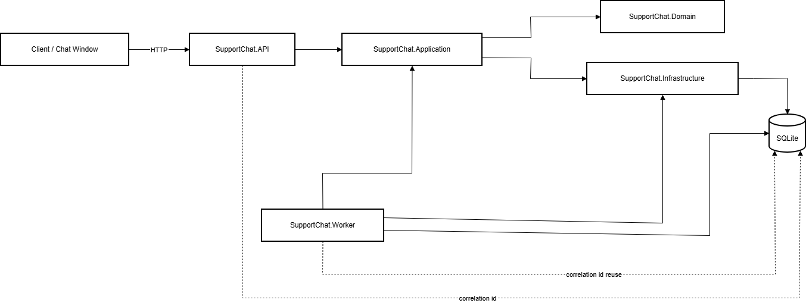
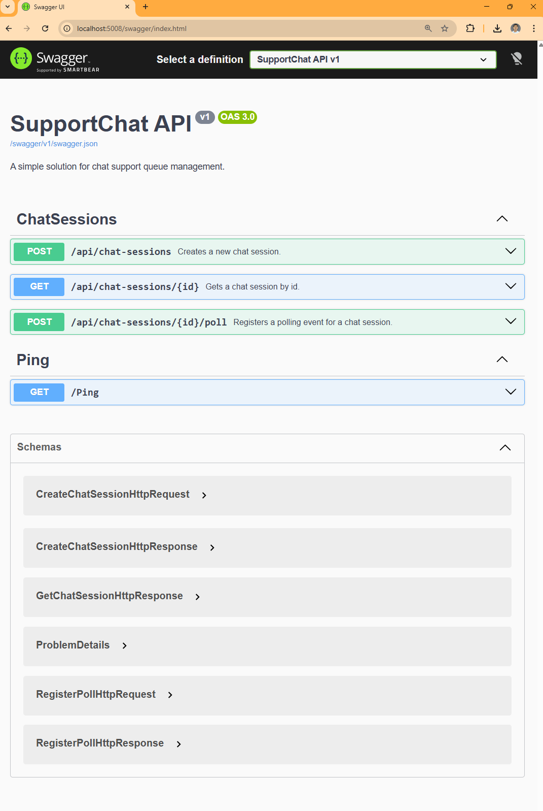
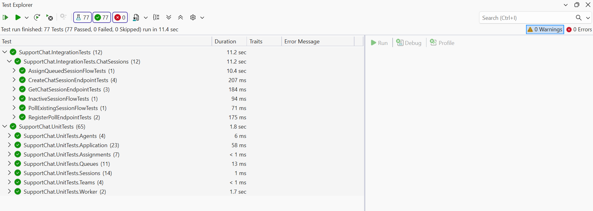

# SupportChat

SupportChat is a .NET 10 solution that simulates a support chat queue with:
- queue admission rules
- session polling
- automatic assignment
- inactive session monitoring
- REST API
- background workers
- SQLite persistence
- correlation-id based tracing capabilities
- Docker Compose support

## Solution structure

- `src/SupportChat.API` — REST API
- `src/SupportChat.Application` — application/use case layer
- `src/SupportChat.Domain` — domain model and rules
- `src/SupportChat.Infrastructure` — EF Core SQLite persistence and providers
- `src/SupportChat.Worker` — background workers
- `tests/SupportChat.UnitTests` — unit tests
- `tests/SupportChat.IntegrationTests` — integration tests



## Technical notes (added before writting codes, might not be up to date)
- [Task analysis](docs/01-task-analysis.md)
- [Assumptions](docs/02-assumptions.md)
- [Business rules](docs/03-business-rules.md)
- [Architecture](docs/04-architecture.md)
- [API contract](docs/05-api-contract.md)
- [Testing strategy](docs/06-testing-strategy.md)

## Key behaviors

- Create chat session
- Get chat session by id
- Register poll for session
- Assign queued sessions in background
- Mark inactive sessions in background after missed polls
- Centralized exception handling
- Correlation id propagation from API into persisted session and worker logs


## API endpoints

### OpenAPI / Swagger

- Swagger UI: `/swagger`
- OpenAPI JSON: `/swagger/v1/swagger.json`



### Create chat session
`POST /api/chat-sessions`

Sample request body:

```json
{
  "currentMainQueueCount": 5,
  "currentOverflowQueueCount": 0,
  "nowUtc": "2026-03-12T10:00:00Z"
}
```

Sample response body:
```json
{
  "admissionResult": "MainQueue",
  "sessionId": "11111111-2222-3333-4444-555555555555"
}
```

### Get chat session
`GET /api/chat-sessions/{id}`

Sample response body:
```json
{
  "sessionId": "11111111-2222-3333-4444-555555555555",
  "status": "Queued",
  "createdAtUtc": "2026-03-12T10:00:00Z",
  "lastPolledAtUtc": "2026-03-12T10:00:01Z",
  "assignedAgentId": null
}
```

### Register poll
`POST /api/chat-sessions/{id}/poll`

Sample request body:

```json
{
  "sessionCreatedAtUtc": "2026-03-12T10:00:00Z",
  "polledAtUtc": "2026-03-12T10:00:01Z"
}
```

Sample response body:
```json
{
  "sessionId": "11111111-2222-3333-4444-555555555555",
  "status": "Queued",
  "lastPolledAtUtc": "2026-03-12T10:00:01Z"
}
```

## Correlation id

The API accepts the header: `X-Correlation-Id`

If not provided, the API generates one.

The correlation id is:
- added to API log scope
- returned in response headers
- persisted with the chat session
- reused in worker logs so the session lifecycle can be traced across processes

## Logging

Structured logging is used via `ILogger`.

Implemented logging areas:
- API request start and completion
- controller-level business actions
- Global exception handling
- worker start/stop/cycle activity
- assignment and inactivity processing

## Exception handling

Global exception handler is implemented and returned as `application/problem+json`.

Current behavior includes:
- not found cases mapped to `404`
- unexpected failures mapped to `500`

## Async and cancellation

API and worker execution paths use async/await and cancellation tokens for:
- repository operations
- use cases
- processor flows
- background service loops

## Configuration

Connection strings are required from configuration.

Main key:

```json
{
  "ConnectionStrings": {
    "SupportChat": "Data Source=supportchat.db"
  }
}
```

The app fails fast if the connection string is missing.

## Run locally

### API
```bash
dotnet run --project src/SupportChat.API
```

### Worker
```bash
dotnet run --project src/SupportChat.Worker
```

## Run tests

```bash
dotnet test
```


## Docker

Root-level Docker files are provided:
- `Dockerfile.api`
- `Dockerfile.worker`
- `docker-compose.yml`

### Build and run
```bash
docker compose up --build
```

### Run in background
```bash
docker compose up -d --build
```

### Stop
```bash
docker compose down
```

### Stop and remove volume
```bash
docker compose down -v
```

### Check running containers
```bash
docker compose ps
```

### View logs
```bash
docker compose logs supportchat-api
docker compose logs supportchat-worker
```

## Docker notes

- API and Worker run as separate containers
- both share the same Docker volume for the SQLite database
- for a real production system, SQLite shared across multiple containers would usually be replaced with a stronger database setup

## Intentional trade-offs
- SQLite was chosen for simplicity and easy local execution
- Background processing is implemented in-process via worker service instead of distributed messaging
- Focus was placed on correctness, clarity, and testability over infrastructure complexity
- The design favors explicit business rules over premature optimization

## What I would do next in production
- Add CI pipeline with build + test + lint checks
- Externalize team/shift configuration to database or configuration service
- Add metrics and dashboards for queue depth, assignment lag, and inactivity detection
- Add retry/idempotency protections for polling and worker operations
- Strengthen concurrency handling for multi-instance deployment
- Replace SQLite with production-grade relational storage
- Add authentication/authorization if exposed beyond internal use
