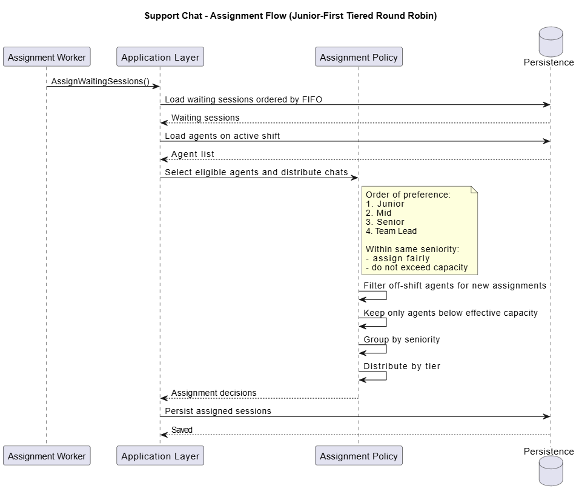

# 03 - Business Rules

## Purpose

The task statement mixes requirements, examples, and implied behavior in a short space. Before coding, I want to rewrite that into explicit rules that are easier to discuss and easier to test.

## Session lifecycle rules

### Rule 1
A support request creates a chat session.

### Rule 2
If accepted, the session enters the managed waiting flow in FIFO order.

### Rule 3
Accepted does not mean assigned. A session may exist in queued state before any agent is attached.

### Rule 4
A session may end up in one of the following broad states:

- Queued
- Assigned
- Inactive
- Rejected
- Completed

## Queue admission rules

### Rule 5
A new session should go to the main queue when the main queue has room.

### Rule 6
If the main queue is full, the system may use overflow only when:

- current time is inside office hours
- overflow still has room

### Rule 7
If neither main queue nor overflow can accept the session, the request must be refused.

## Polling and inactivity rules

### Rule 8
After receiving OK, the client polls every second.

### Rule 9
If the system does not receive three expected polls, the session becomes inactive.

### Rule 10
Inactive sessions must stop consuming live operational capacity.

## Agent eligibility rules

### Rule 11
An agent may receive a new chat only when the agent is eligible for new work.

### Rule 12
If an agent’s shift ends, that agent may finish already assigned chats but must not receive new ones.

## Capacity rules

### Rule 13
Each agent has a base capacity of 10 chats.

### Rule 14
Effective capacity is base capacity multiplied by seniority multiplier.

Current multipliers from the task:

- Junior = 0.4
- Mid-Level = 0.6
- Senior = 0.8
- Team Lead = 0.5

### Rule 15
Team capacity is the sum of effective capacities of eligible agents.

### Rule 16
Queue capacity is 1.5 times effective team capacity, rounded down when needed.

## Assignment rules

### Rule 17
Waiting sessions should be considered in FIFO order.

### Rule 18
Assignment should prefer lower seniority first so that more senior people remain more available to help others.

### Rule 19
Within the same seniority band, allocation should stay fair rather than repeatedly loading the same person.

## What these rules mean for implementation

The big takeaway for me is that the heart of the system is policy evaluation. HTTP endpoints and background workers are important, but they are not where the real difficulty lives.
